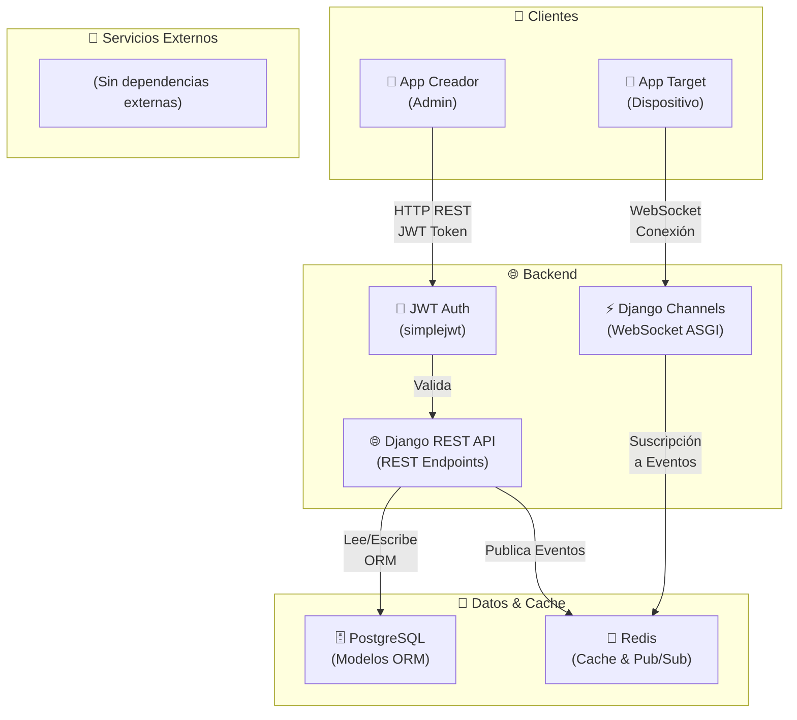
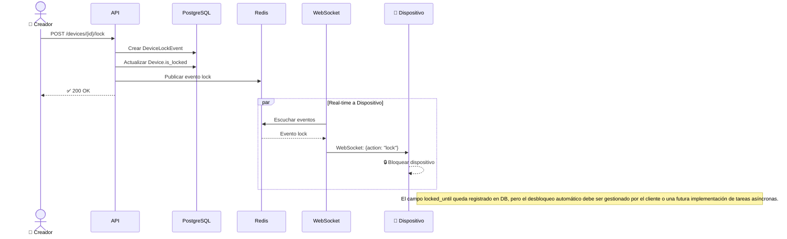
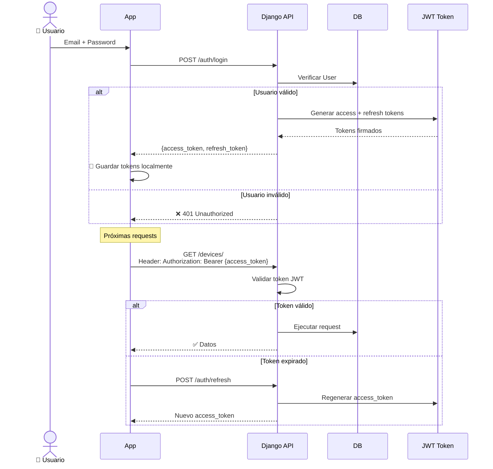

# 🔐 Secure Lock Backend

Backend robusto de una aplicación móvil para **bloqueo remoto de dispositivos** en tiempo real. 

El sistema sigue un modelo **Freemium**, permitiendo a los usuarios creadores administrar dispositivos, agruparlos en salas mediante códigos QR y ejecutar bloqueos programados o instantáneos. 

*Nota de Desarrollo:* Esta fase del proyecto está optimizada para demostraciones con **Expo Go**, utilizando **WebSockets** como motor principal de tiempo real. El código cuenta con "Degradación Elegante" (Graceful Degradation), lo que significa que la infraestructura para notificaciones Push nativas está programada pero desactivada hasta su futura compilación en código nativo puro.

### 📋 Características Principales

- ✅ **Autenticación JWT** con roles diferenciados (Creator / Target)
- ✅ **Bloqueo remoto en tiempo real instantáneo** mediante WebSockets
- ✅ **Modelo Freemium** con planes Premium
- ✅ **Organización de dispositivos** por salas
- ✅ **Códigos QR** para invitaciones a salas
- ✅ **Auditoría completa** de eventos de bloqueo
- ✅ **Alto rendimiento** con Redis y Channels

---

## 🏗️ Arquitectura del Sistema

El flujo de datos está diseñado para ser **rápido** y **tolerante a fallos**, utilizando **Django Channels** para conexiones persistentes.



---

## 📁 Estructura del Proyecto

```
AppMovil-Backend/
├── 📄 Docker & Configuración
│   ├── Dockerfile
│   ├── docker-compose.yml
│   ├── requirements.txt
│   └── manage.py
│
├── 🔑 Core Config
│   └── secure_lock/
│       ├── settings.py          # Configuración Django
│       ├── asgi.py              # ASGI para WebSockets
│       ├── wsgi.py              # WSGI para Gunicorn
│       ├── urls.py              # Router principal
│       └── routing.py           # WebSocket routing
│
├── 👥 Módulo: Usuarios
│   ├── users/
│   │   ├── models.py            # Modelo User (Creator/Target)
│   │   ├── serializers.py       # Serialización
│   │   ├── views.py             # Endpoints REST
│   │   ├── urls.py              # Rutas
│   │   ├── managers.py          # Custom QuerySet
│   │   ├── admin.py             # Panel admin
│   │   ├── apps.py
│   │   ├── __init__.py
│   │   └── migrations/
│   │       ├── 0001_initial.py
│   │       └── 0002_initial.py
│
├── 📱 Módulo: Dispositivos
│   ├── dispositivos/
│   │   ├── models.py            # Device, DeviceLockEvent
│   │   ├── serializers.py       # Serialización
│   │   ├── views.py             # CRUD endpoints
│   │   ├── urls.py              # Rutas
│   │   ├── services.py          # Lógica de negocio
│   │   ├── consumers.py         # WebSocket consumers
│   │   ├── routing.py           # Rutas WebSocket
│   │   ├── permissions.py       # Permisos custom
│   │   ├── admin.py             # Panel admin
│   │   ├── apps.py
│   │   ├── __init__.py
│   │   └── migrations/
│   │       ├── 0001_initial.py
│   │       └── 0002_initial.py
│
├── 🏠 Módulo: Salas
│   ├── salas/
│   │   ├── models.py            # Modelo Room
│   │   ├── serializers.py       # Serialización
│   │   ├── views.py             # Endpoints REST
│   │   ├── urls.py              # Rutas
│   │   ├── services.py          # Lógica de negocio
│   │   ├── admin.py             # Panel admin
│   │   ├── apps.py
│   │   ├── __init__.py
│   │   └── migrations/
│   │       ├── 0001_initial.py
│   │       └── 0002_initial.py
│
└── 💳 Módulo: Suscripciones
    └── suscripciones/
        ├── models.py            # Modelo Subscription
        ├── serializers.py       # Serialización
        ├── views.py             # Endpoints REST
        ├── urls.py              # Rutas
        ├── services.py          # Lógica de negocio
        ├── admin.py             # Panel admin
        ├── apps.py
        ├── __init__.py
        └── migrations/
            ├── 0001_initial.py
            └── 0002_initial.py
```

---

## 🗄️ Diagrama de Modelos de Datos

```mermaid
erDiagram
    USER ||--o{ DEVICE : owns
    USER ||--o{ ROOM : administers
    USER ||--o{ SUBSCRIPTION : has
    DEVICE ||--o{ DEVICELOCKEVENT : logs
    DEVICE }o--|| USER : locked_by
    DEVICE }o--o{ ROOM : belongs_to
    
    USER {
        int id PK
        string email UK
        string full_name
        string role "CREATOR | TARGET"
        boolean is_active
        datetime date_joined
    }
    
    DEVICE {
        int id PK
        int owner_id FK
        string id_unico UK
        string display_name
        string fcm_token
        boolean is_locked
        int battery_level
        datetime locked_at
        datetime locked_until
        string platform
        datetime last_seen
        datetime created_at
    }
    
    DEVICELOCKEVENT {
        int id PK
        int device_id FK
        int requested_by_id FK
        string action "LOCK | UNLOCK | AUTO_UNLOCK"
        string reason
        int duration_minutes
        datetime expires_at
        datetime created_at
    }
    
    ROOM {
        int id PK
        int admin_id FK
        string name
        string invite_code UKz
        datetime created_at
    }
    
    SUBSCRIPTION {
        int id PK
        int user_id FK
        string plan_type "FREE | PREMIUM"
        decimal price_usd
        string status "ACTIVE | CANCELED | EXPIRED"
        datetime starts_at
        datetime expires_at
    }
```

---

## 🔄 Flujos Principales

### Flujo de Bloqueo Remoto



### Flujo de Autenticación



---

## 🛠️ Stack Tecnológico

| Componente | Tecnología | Versión |
|-----------|-----------|---------|
| **Framework** | Django | 4.2+ |
| **API REST** | Django REST Framework | 3.15.0+ |
| **Autenticación** | djangorestframework-simplejwt | 5.3.1+ |
| **WebSockets** | Django Channels | 4.1.0+ |
| **WebSocket Redis** | channels-redis | 4.2.0+ |
| **Base de Datos** | PostgreSQL | 16+ |
| **Driver PostgreSQL** | psycopg2-binary | 2.9.9+ |
| **Cache & Pub/Sub** | Redis | 5.0.7+ |
| **Web Server** | Gunicorn + Uvicorn | 22.0.0+ |
| **CORS** | django-cors-headers | 4.4.0+ |
| **QR Codes** | qrcode | 7.4.2+ |
| **Containerización** | Docker & Docker Compose | Latest |

---

## ⚙️ Instalación y Configuración

### Prerequisitos

- Python 3.10+
- Docker & Docker Compose
- PostgreSQL 14+
- Redis 6.0+

### 1️⃣ Clonar Repositorio

```bash
git clone <tu-repo>
cd AppMovil-Backend
```

### 2️⃣ Variables de Entorno

Crear archivo `.env` en la raíz del proyecto:

```env
# Core Django
SECRET_KEY=your-secret-key-change-in-production
DEBUG=False
ALLOWED_HOSTS=localhost,127.0.0.1,your-domain.com

# Base de Datos
DB_NAME=secure_lock
DB_USER=admin
DB_PASSWORD=secure123
DB_HOST=db
DB_PORT=5432

# Redis
REDIS_URL=redis://localhost:6379/0
REDIS_HOST=redis
REDIS_PORT=6379

# JWT
JWT_SECRET_KEY=your-jwt-secret-key
JWT_ALGORITHM=HS256
JWT_EXPIRATION_HOURS=24
JWT_REFRESH_EXPIRATION_DAYS=7

# CORS
CORS_ALLOWED_ORIGINS=http://localhost:3000,https://your-app.com

# Suscripciones
PREMIUM_PRICE_USD=13.00
```

### 3️⃣ Instalación Local

```bash
# Crear entorno virtual
python -m venv venv

# Activar entorno virtual
# Windows:
venv\Scripts\activate
# macOS/Linux:
source venv/bin/activate

# Instalar dependencias
pip install -r requirements.txt

# Aplicar migraciones
python manage.py migrate

# Crear superusuario
python manage.py createsuperuser

# Ejecutar servidor de desarrollo
python manage.py runserver
```

### 4️⃣ Instalación con Docker

```bash
# Construir imágenes
docker-compose build

# Ejecutar contenedores
docker-compose up -d

# Ver logs
docker-compose logs -f backend

# Crear superusuario
docker-compose exec backend python manage.py createsuperuser

# Aplicar migraciones
docker-compose exec backend python manage.py migrate
```

---

## 🚀 Ejecutar en Desarrollo

### Backend Django

```bash
# Desarrollo local
python manage.py runserver 0.0.0.0:8000

# Con Uvicorn (ASGI)
uvicorn secure_lock.asgi:application --host 0.0.0.0 --port 8000 --reload
```

### Redis

```bash
# Con Docker Compose
docker-compose up redis db

# O localmente
redis-server
```

---

## 📌 Endpoints Principales

### Autenticación

| Método | Endpoint | Descripción |
|--------|----------|------------|
| `POST` | `/api/auth/register/` | Registrar nuevo usuario |
| `POST` | `/api/auth/login/` | Login y obtener tokens JWT |
| `POST` | `/api/auth/refresh/` | Renovar access token |
| `POST` | `/api/auth/logout/` | Cerrar sesión |

### Dispositivos

| Método | Endpoint | Descripción |
|--------|----------|------------|
| `GET` | `/api/devices/` | Listar dispositivos del usuario |
| `POST` | `/api/devices/` | Registrar nuevo dispositivo |
| `GET` | `/api/devices/{id}/` | Detalles de un dispositivo |
| `PUT` | `/api/devices/{id}/` | Actualizar dispositivo |
| `DELETE` | `/api/devices/{id}/` | Eliminar dispositivo |
| `POST` | `/api/devices/{id}/lock/` | 🔒 Bloquear dispositivo |
| `POST` | `/api/devices/{id}/unlock/` | 🔓 Desbloquear dispositivo |
| `GET` | `/api/devices/{id}/lock-events/` | Historial de bloqueos |

### Salas

| Método | Endpoint | Descripción |
|--------|----------|------------|
| `GET` | `/api/rooms/` | Listar salas del usuario |
| `POST` | `/api/rooms/` | Crear nueva sala |
| `GET` | `/api/rooms/{id}/` | Detalles de una sala |
| `PUT` | `/api/rooms/{id}/` | Actualizar sala |
| `DELETE` | `/api/rooms/{id}/` | Eliminar sala |
| `POST` | `/api/rooms/{id}/add-device/` | Agregar dispositivo a sala |
| `DELETE` | `/api/rooms/{id}/remove-device/` | Remover dispositivo de sala |
| `GET` | `/api/rooms/invite/{code}/` | Unirse a sala por código |

### Suscripciones

| Método | Endpoint | Descripción |
|--------|----------|------------|
| `GET` | `/api/subscriptions/` | Ver suscripción actual |
| `POST` | `/api/subscriptions/upgrade/` | Actualizar a Premium |
| `POST` | `/api/subscriptions/cancel/` | Cancelar suscripción |
| `GET` | `/api/subscriptions/plans/` | Listar planes disponibles |

---

##  WebSocket / Real-time

### Conexión WebSocket (Autenticada con JWT)

A partir de Abril 2026, las conexiones WebSocket requieren autenticación JWT válida.

**Paso 1: Obtener JWT Token**

```bash
curl -X POST http://localhost:8000/api/auth/login/ \
  -d "email=user@example.com&password=password" \
  -H "Content-Type: application/json"

# Respuesta: {"access": "eyJ...", "refresh": "eyJ..."}
```

**Paso 2: Conectar WebSocket con Token**

```javascript
// Cliente (JavaScript)
const token = localStorage.getItem('access_token');
const socket = new WebSocket(
    `wss://localhost:8000/ws/devices/device-unique-id/?token=${token}`
);

socket.onopen = (event) => {
    console.log('✅ Conectado al WebSocket');
};

socket.onmessage = (event) => {
    const data = JSON.parse(event.data);
    console.log('📨 Mensaje en tiempo real:', data);
};

socket.onerror = (event) => {
    if (event.code === 4001) {
        console.error('❌ Error 4001: Token JWT inválido o expirado');
    } else if (event.code === 4003) {
        console.error('❌ Error 4003: No tienes permiso para este dispositivo');
    } else {
        console.error('❌ Error:', event);
    }
};

socket.onclose = (event) => {
    console.log('⚠️ Desconectado. Reconectando en 5 segundos...');
    setTimeout(() => location.reload(), 5000);
};
```

### Códigos de Error WebSocket

| Código | Significado | Acción |
|--------|-----------|--------|
| `4001` | Token inválido/expirado | Obtener nuevo token con refresh |
| `4003` | Usuario no autorizado | Verificar ownership del dispositivo |
| `1000` | Cierre normal | Reconectar después de reautenticar |
| `1006` | Cierre anormal | Verificar conexión a Red/Redis |

### Eventos WebSocket

```javascript
// Evento de bloqueo
{
    "type": "lock_event",
    "action": "LOCK",
    "device_id": 123,
    "timestamp": "2024-04-12T10:30:00Z",
    "duration_minutes": 30
}

// Evento de desbloqueo
{
    "type": "lock_event",
    "action": "UNLOCK",
    "device_id": 123,
    "timestamp": "2024-04-12T11:00:00Z"
}

// Actualización de estado
{
    "type": "device_update",
    "device_id": 123,
    "battery_level": 75,
    "last_seen": "2024-04-12T10:35:00Z"
}
```

---

## 🧪 Testing

```bash
# Ejecutar tests
python manage.py test

# Tests con cobertura
coverage run --source='.' manage.py test
coverage report

# Tests específicos
python manage.py test usuarios.tests
```

---

## 📊 Admin Panel

Acceder a panel administrativo:

```
URL: http://localhost:8000/admin/
Usuario: (el que creaste con createsuperuser)
Contraseña: (la que configuraste)
```

### Modelos disponibles en Admin

- ✅ Usuarios (Users)
- ✅ Dispositivos (Devices)
- ✅ Eventos de Bloqueo (DeviceLockEvent)
- ✅ Salas (Rooms)
- ✅ Suscripciones (Subscriptions)

---

## 🔐 Seguridad

### Implementado

- ✅ **JWT Token-based** autenticación (REST API)
- ✅ **WebSocket JWT Authentication** con validación de tokens y ownership de dispositivos
- ✅ **CORS** configurado
- ✅ **Permisos** por rol (Creator/Target)
- ✅ **HTTPS** en producción
- ✅ **SECRET_KEY** secreto
- ✅ **Rate limiting** implementado
- ✅ **CSRF** protección
- ✅ **SQL Injection** protección (ORM Django)
- ✅ **Database Integrity** con SET_NULL para auditoría

### Mejoras de Seguridad - Abril 2026

#### 1. WebSocket JWT Authentication
Se implementó middleware personalizado (`users/middleware.py`) que:
- Extrae tokens JWT del query string: `ws://localhost:8000/ws/devices/{id}/?token=JWT`
- Valida tokens usando `rest_framework_simplejwt`
- Cierra conexiones no autenticadas con código `4001` (Unauthorized)
- Verifica que el usuario sea propietario del dispositivo (código `4003` si no autorizado)

**Implementación:**
```javascript
// Cliente: Conectar con WebSocket autenticado
const token = localStorage.getItem('access_token');
const socket = new WebSocket(
    `ws://localhost:8000/ws/devices/device-123/?token=${token}`
);

socket.onopen = () => console.log('✅ Conectado con autenticación');
socket.onerror = (e) => {
    if (e.code === 4001) console.error('❌ Token inválido');
    if (e.code === 4003) console.error('❌ No autorizado para este dispositivo');
};
```

**Archivos modificados:**
- `users/middleware.py` (nuevo) - TokenAuthMiddleware
- `secure_lock/asgi.py` - Reemplaza AuthMiddlewareStack con TokenAuthMiddleware
- `dispositivos/consumers.py` - Validación JWT en connect()

#### 2. Integridad de Auditoría
- **DeviceLockEvent.requested_by**: `on_delete=models.SET_NULL` preserva historial de eventos incluso si usuario se elimina
- **DeviceLockEvent.device**: Configurado con CASCADE para evitar eventos huérfanos

### Configuración de Seguridad en Producción

```python
# settings.py
DEBUG = False
ALLOWED_HOSTS = ['your-domain.com']
SECRET_KEY = os.getenv("SECRET_KEY")

# SSL & HTTPS
SECURE_SSL_REDIRECT = True
SESSION_COOKIE_SECURE = True
CSRF_COOKIE_SECURE = True

# Headers de Seguridad
SECURE_BROWSER_XSS_FILTER = True
X_FRAME_OPTIONS = "DENY"
SECURE_HSTS_SECONDS = 31536000
SECURE_HSTS_INCLUDE_SUBDOMAINS = True
SECURE_HSTS_PRELOAD = True

# Content Security Policy (opcional)
SECURE_CONTENT_SECURITY_POLICY = {
    "default-src": ("'self'",),
    "script-src": ("'self'", "trusted-cdn.com"),
    "style-src": ("'self'", "'unsafe-inline'"),
    "img-src": ("'self'", "data:", "https:"),
}
```

### Comandos para Aplicar Cambios

```bash
# Aplicar migraciones (incluye cambios de seguridad)
docker-compose exec backend python manage.py migrate

# Reiniciar servicios
docker-compose restart backend redis
```

---

## 📈 Monitoreo y Logs

### Logs de Django

```python
# settings.py
LOGGING = {
    'version': 1,
    'disable_existing_loggers': False,
    'handlers': {
        'file': {
            'level': 'INFO',
            'class': 'logging.FileHandler',
            'filename': 'logs/django.log',
        },
    },
    'loggers': {
        'django': {
            'handlers': ['file'],
            'level': 'INFO',
            'propagate': True,
        },
    },
}
```

---

## 🐛 Troubleshooting

### Problema: No conecta a PostgreSQL

```bash
# Verificar conexión
python manage.py dbshell

# Revisar settings DB_HOST, DB_PORT, DB_NAME
# Verificar PostgreSQL está corriendo
docker-compose ps db

# Ver logs de PostgreSQL
docker-compose logs db
```

### Problema: WebSocket no funciona

```bash
# Verificar Redis está corriendo
redis-cli ping  # Debe devolver PONG

# Verificar Channels está instalado
pip install channels channels-redis
```

---

## 📚 Recursos Útiles

- [Django Documentation](https://docs.djangoproject.com/)
- [Django REST Framework](https://www.django-rest-framework.org/)
- [Django Channels](https://channels.readthedocs.io/)
- [JWT Best Practices](https://tools.ietf.org/html/rfc7519)

---

## 📝 Licencia

Este proyecto está bajo licencia [MIT](LICENSE).

---

## 👥 Contribuciones

Las contribuciones son bienvenidas. Por favor:

1. Fork el proyecto
2. Crea una rama (`git checkout -b feature/AmazingFeature`)
3. Commit cambios (`git commit -m 'Add AmazingFeature'`)
4. Push a la rama (`git push origin feature/AmazingFeature`)
5. Abre un Pull Request

---

## 📞 Contacto

Para preguntas o sugerencias, abre un issue en el repositorio.

---

**Última actualización:** Abril 2026
