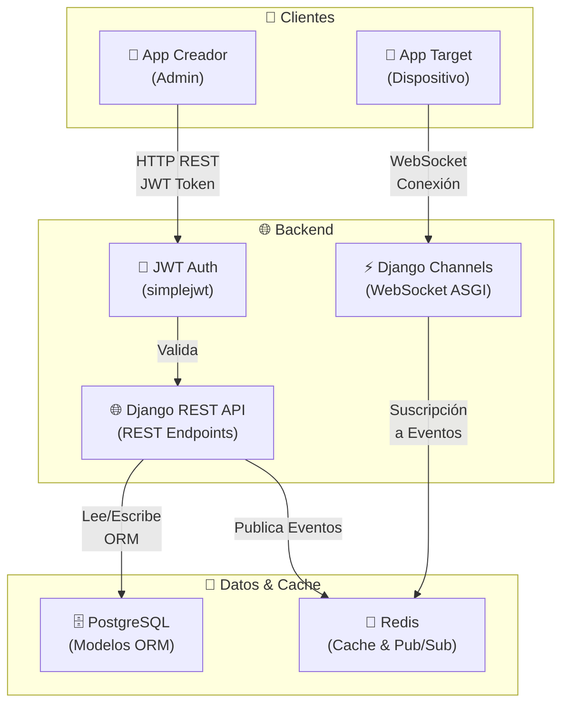
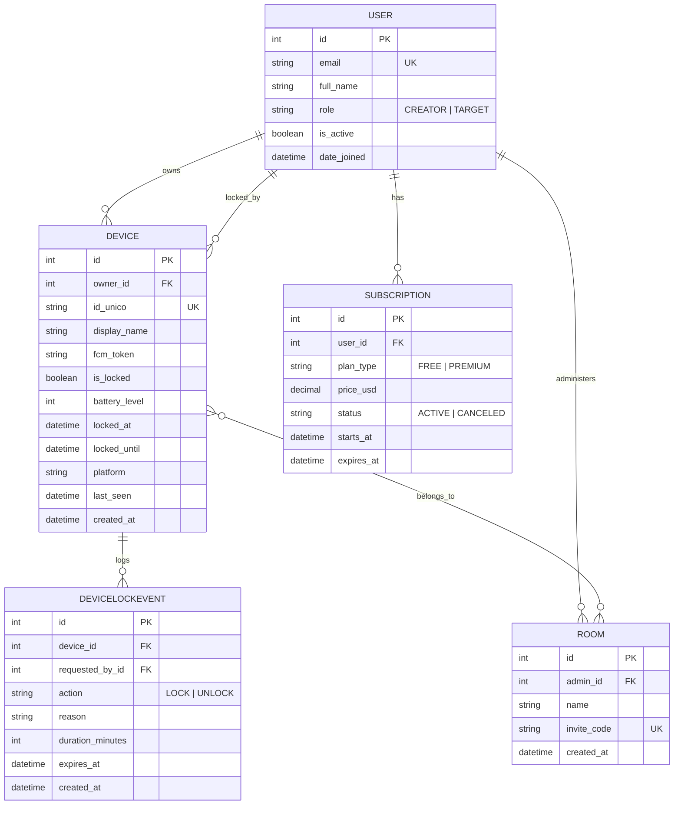
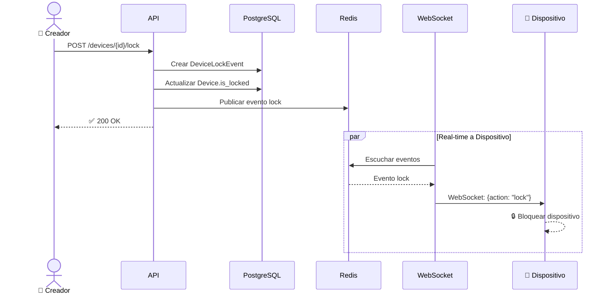
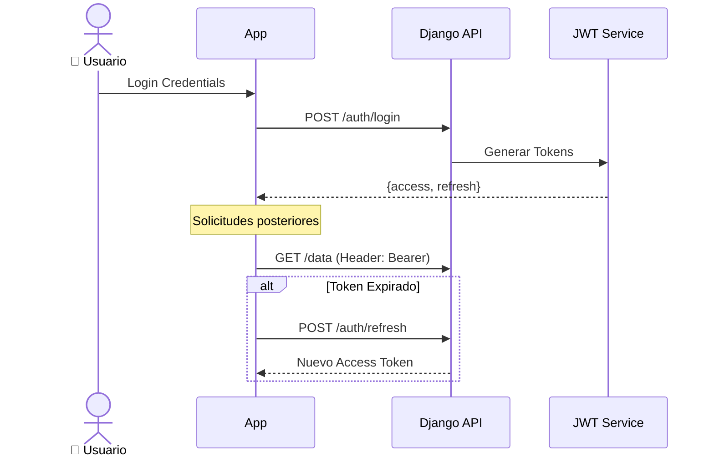

<p align="center">
  
</p>

# 🔐 Secure Lock Backend

> [!IMPORTANT]
> **Secure Lock** is a robust backend solution for real-time remote device locking, designed with a focus on security, performance, and scalability.

El sistema sigue un modelo **Freemium**, permitiendo a los usuarios creadores administrar dispositivos, agruparlos en salas mediante códigos QR y ejecutar bloqueos programados o instantáneos. 

> [!TIP]
> Esta fase del proyecto está optimizada para demostraciones con **Expo Go**, utilizando **WebSockets** como motor principal de tiempo real. El código cuenta con **"Degradación Elegante"** (Graceful Degradation).

---

## 📋 Características Principales

- 🔐 **Autenticación JWT**: Roles diferenciados (Creator / Target).
- ⚡ **Tiempo Real**: Bloqueo remoto instantáneo mediante WebSockets.
- 💳 **Modelo Freemium**: Gestión de planes y suscripciones Premium.
- 🏠 **Organización Inteligente**: Gestión de dispositivos por salas y códigos QR.
- 📑 **Auditoría**: Registro completo de eventos de bloqueo y actividad.
- 🚀 **Alto Rendimiento**: Integración con Redis y Django Channels.

---

## 🏗️ Arquitectura del Sistema

La arquitectura está diseñada para ser **altamente reactiva** y **tolerante a fallos**, minimizando la latencia en las operaciones de bloqueo.



---

## 📁 Estructura del Proyecto

Organización modular siguiendo las mejores prácticas de Django:

```text
AppMovil-Backend/
├── 🔑 core/                 # Configuración principal (Settings, ASGI/WSGI, Routing)
├── 👥 users/                # Gestión de usuarios, roles y autenticación JWT
├── 📱 dispositivos/         # Modelos de dispositivos, eventos y lógica WebSocket
├── 🏠 salas/                # Organización de dispositivos en espacios compartidos
└── 💳 suscripciones/       # Lógica de planes freemium y pagos
```

---

## 🗄️ Diagrama de Modelos de Datos



---

## 🔄 Flujos de Trabajo

### 1. Bloqueo Remoto (Real-time)


### 2. Autenticación y Refresh


---

## 🛠️ Stack Tecnológico

| Capa | Tecnología | Propósito |
| :--- | :--- | :--- |
| **Backend** | Django 4.2+ | Framework robusto y escalable |
| **Real-time** | Django Channels | Gestión de WebSockets asíncronos |
| **API** | DRF | REST Framework para endpoints móviles |
| **Database** | PostgreSQL 16 | Almacenamiento relacional persistente |
| **Cache/Pub-Sub** | Redis | Motor para Channels y caché rápida |
| **Auth** | SimpleJWT | Estándar de seguridad para APIs |

---

## ⚙️ Instalación y Configuración

### 🐳 Con Docker (Recomendado)

```bash
# 1. Construir y levantar servicios
docker-compose up -d --build

# 2. Aplicar migraciones
docker-compose exec backend python manage.py migrate

# 3. Crear administrador
docker-compose exec backend python manage.py createsuperuser
```

### 🐍 Instalación Manual

1. **Entorno**: `python -m venv venv` y actívalo.
2. **Dependencias**: `pip install -r requirements.txt`.
3. **Migraciones**: `python manage.py migrate`.
4. **Ejecutar**: `python manage.py runserver`.

---

## 🔐 Seguridad Avanzada

> [!NOTE]
> Se han implementado medidas de seguridad críticas en la última actualización (Abril 2026).

- **WebSocket Auth**: Middleware personalizado que valida JWT en conexiones persistentes.
- **Ownership Validation**: Los dispositivos solo aceptan conexiones del propietario verificado.
- **Auditoría Persistente**: Uso de `SET_NULL` para mantener logs incluso tras eliminar usuarios.
- **HSTS & SSL**: Configuración lista para entornos de producción seguros.

---

## 📌 Endpoints Clave

| Recurso | Método | Endpoint |
| :--- | :--- | :--- |
| **Auth** | `POST` | `/api/auth/login/` |
| **Devices** | `POST` | `/api/devices/{id}/lock/` |
| **Rooms** | `GET` | `/api/rooms/invite/{code}/` |
| **Plans** | `GET` | `/api/subscriptions/plans/` |

---

<p align="center">
  Desarrollado con ❤️ por el equipo de Secure Lock. 2026.
</p>
